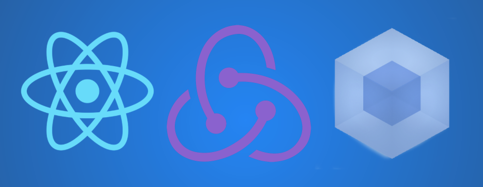

# React / Redux Boilerplate

[](https://circleci.com/gh/aggelog/React-Redux-Boilerplate) [](https://coveralls.io/github/aggelog/React-Redux-Boilerplate?branch=master) [](https://opensource.org/licenses/MIT)



|  Main Stack  |     Middleware     | Unit Testing | Static Testing | Other Libraries - Tools |
|:------------:|:------------------:|:------------:|:--------------:|:-----------------------:|
|    [ReactJS](https://facebook.github.io/react/)   | [React-Router-Redux](https://github.com/reactjs/react-router-redux) |    [Ava.JS](https://github.com/avajs/ava)    |     [ESLint](http://eslint.org/)     |         [Webpack](https://github.com/webpack/webpack)         |
|    [ReduxJS](http://redux.js.org/)   |     [Redux-Thunk](https://github.com/gaearon/redux-thunk)    |   [Sinon.JS](http://sinonjs.org/)   |    [stylelint](http://stylelint.io/)   |        [Redux-Form](http://redux-form.com/6.2.0/)       |
|  [ImmutableJS](https://facebook.github.io/immutable-js/) |    [Redux-Logger](https://github.com/evgenyrodionov/redux-logger)    |    [Enzyme](http://airbnb.io/enzyme/)    |                |          [Axios](https://github.com/mzabriskie/axios)          |
|  [ECMAScript 6](http://es6-features.org/) |                    |      [nyc](https://github.com/istanbuljs/nyc)     |                |        [classnames](https://github.com/JedWatson/classnames)       |

Requirements
------------
  - Git
  - Node.js v6.x.x

Installation Instructions
-------------------------

####Mac
---

Open a terminal and:

Install Homebrew (if not already installed)

```sh
ruby -e "$(curl -fsSL https://raw.githubusercontent.com/Homebrew/install/master/install)"
```
    
Install Git (if not already installed):

```sh
brew doctor
brew update
brew install git
```    
Close and reopen the terminal window.

Install Node v6.x.x (if not already installed):

```sh
brew install node
```

Switch to the folder you want to store this project into and clone the repository:

```sh
git clone [git-repo-url]
```

or use your preferred git tool to do so.

Configure npm packages:

```sh
npm install
```

---

Usage
-----

* Builds your project into the /public folder.
    ```sh
    npm run build
    ```

* Builds your project into the /public folder with debug mode.
    ```sh
    npm run build:debug
    ```

* Launches Browsersync which will start your project in the default browser.
    ```sh
    npm run start
    ```

* Runs static type checking both on JS and SCSS.
    ```sh
    npm run lint
    ```

* Runs static type checking on JS.
    ```sh
    npm run eslint
    ```

* Runs static type checking on SCSS.
    ```sh
    npm run stylelint
    ```

* Runs the unit tests under /test directory.
    ```sh
    npm run test
    ```

* Launches a local server that will run the unit tests every time code changes are made.
    ```sh
    npm run test:watch
    ```

* Runs the unit tests and the code coverage ( it outputs the results both in console and in html under /coverage directory).
    ```sh
    npm run coverage
    ```

* Launches a local server that will run the unit tests and the code coverage every time code changes are made.
    ```sh
    npm run cover:watch
    ```

* Runs a check on the code coverage , if the any of the percentages are below the limits this command will fail.
    ```sh
    npm run check-coverage
    ```

* Cleans your project.
    ```sh
    npm run clean
    ```

License
-------
See the [LICENSE](LICENSE.txt) file for license rights and limitations (MIT).